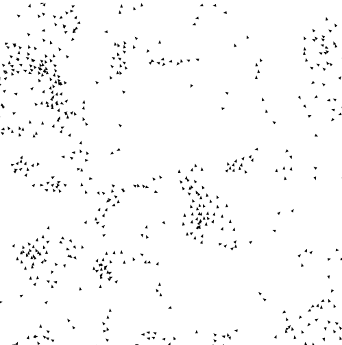
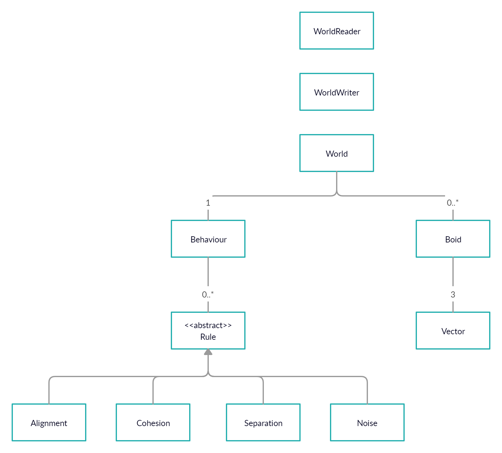

<h1 align=center>Boids</h1>

<i>A flocking simulator written in Java</i>

## About The Project

Developed by Craig Reynolds in 1986, boids are a form of artificial life that mimic the flocking behaviour of birds. Boids are able to form beautiful, mesmerizing patterns by following these three rules: 
- Separation: Steer to avoid crowding local flockmates
- Alignment: Steer towards the average heading of local flockmates
- Cohesion: Steer to move towards the average position (center of mass) of local flockmates

[Further reading](https://en.wikipedia.org/wiki/Boids)

## User Stories

- [x] As a user, I want to be able to generate a world
- [x] As a user, I want to be able to add a body to a world
- [x] As a user, I want to be able to move all boids in a world
- [x] As a user, I want to be able to view the list of all boids in a world
- [x] As a user, I want to be able to automatically save a world when the program quits
- [x] As a user, I want to be able to optionally load my world file when the program starts

## Instructions for Grader

- You can generate a world by starting the program and following the prompt
- You can adjust the dimensions of a world by changing the size of the window
- You can add a boid to the world by clicking anywhere in the window
- You can move the boids by leaving the application open as there is a main loop that runs in the background
- You can view all of the boids in the main application
- You can save the state of the world by closing the application
- You can then optionally load the state of the world when reopening the application
- *NOTE: There are predefined values in the "Boid Simulation Settings" section of the WorldApp class that you can try adjusting to discover new behaviour patterns*

## Phase 4: Task 2

This project demonstrates a type hierarchy. In order to construct the behaviour of a boid, I designed a behaviour object which contains a list of rules. A rule is a distinct instruction that every boid follows. Each rule must override a method named `update()` which takes in a `Boid` object and `World` object and returns a `Vector` representing a force. There are 4 predefined rules included in this project. There are the three standard rules (`Separation`, `Alignment`, and `Cohesion`) which Craig Reynolds described, along with a `Noise` rule which returns a random force tangential to the given boids direction.

## Phase 4: Task 3

- Behaviour System:  
    This has been briefly covered in the "Phase 4: Task 2" section. The previous implementation for adding behaviour to boids involved directly adding the `Separation`, `Alignment`, and `Cohesion` code directly inside the `Boid` class. By refactoring the behaviour to be external, the `Boid` class only has to deal with implementing the movement physics and transformation details.
    
- Rendering System:  
    In order to keep high cohesion within the `Boid` class, I extracted the rendering logic from `Boid`  and placed it inside `WorldApp`. This allowed the `Boid` class to not have to maintain multiple responsibilities, and this also allowed for better unit testing.

## UML Class Diagram

## License
[MIT](https://choosealicense.com/licenses/mit/)
